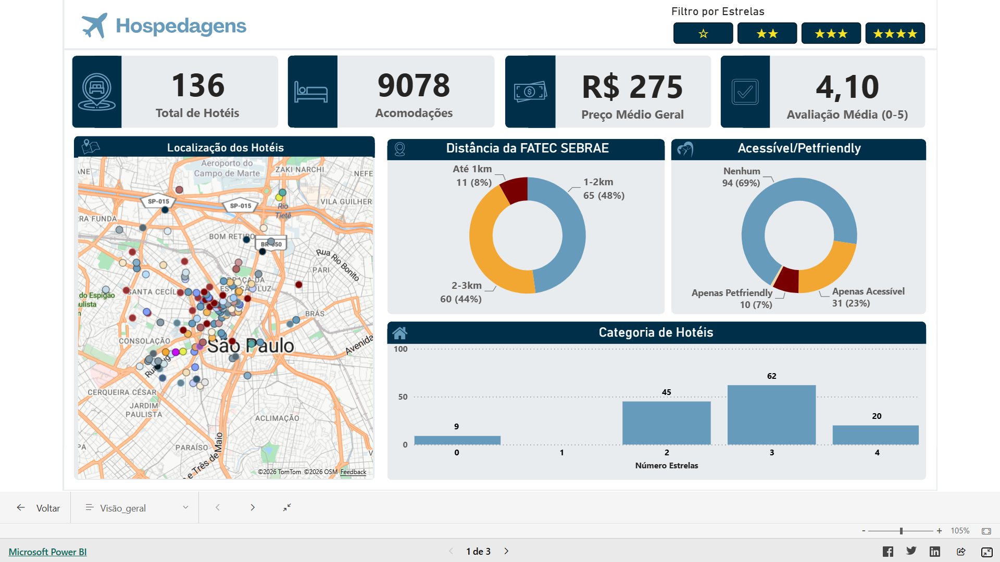
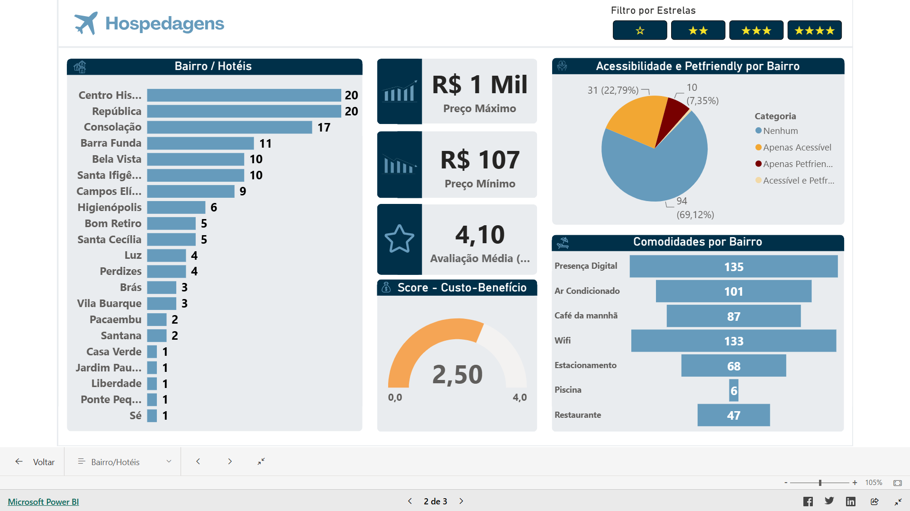
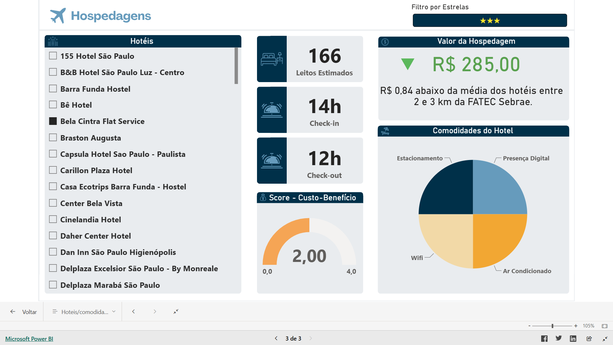

# Análise de Mercado de Hospedagens

## Objetivo
Analisar o mercado de hospedagens em um raio de 3 km da Fatec Sebrae, identificando padrões de concorrência e oportunidades de negócio.

## Ferramentas Utilizadas
- Excel
- Power BI
- Google Maps (para coleta de dados)
- Booking.com (também para coleta de dados)

## Principais Atividades
- Coleta e organização dos dados
- Tratamento das informações
- Análise comparativa dos estabelecimentos
- Criação de dashboard interativo

## 📊 Dashboard de Hotéis

### 🏨 Visão Geral

### 🏙️ Tela por Bairro

### 🏨 Tela por Hotel

## 📊 Dashboard de Hotéis (Power BI)

Clique para acessar o dashboard interativo:

👉 https://app.powerbi.com/view?r=eyJrIjoiOWE2YmRlYzQtYTE1Yi00NjA5LWIxODUtMjIwODg0MjAxOWYwIiwidCI6ImVhYmU2NGM1LTY4ZjUtNGE3Ni04MzAxLTk1NzdhNjc5ZTQ0OSIsImMiOjR9&pageName=f162a14b80538d4e401e

## Resultados
O projeto gerou insights sobre a concorrência local e oportunidades de mercado, sendo selecionado para apresentação no Meta Day da Fatec.
